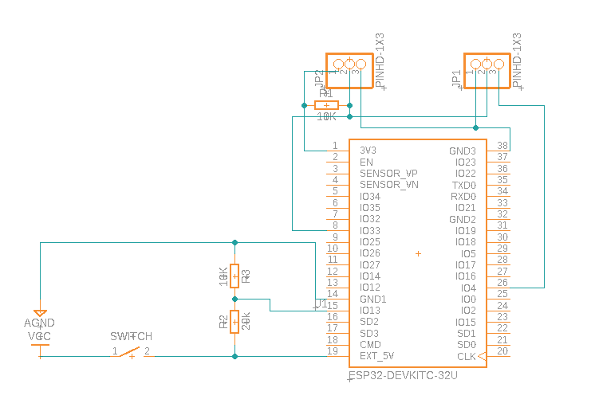
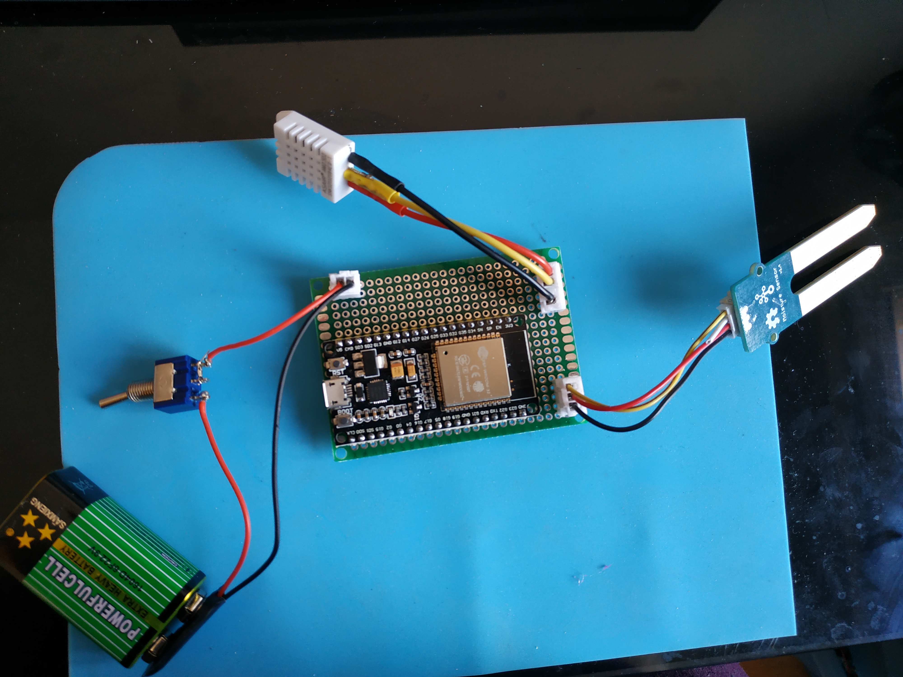

Dossier platformio pour injecter un .bin sur un ESP_32 dev kit v4

la dev kit peut s'alimenter par batterie sur le 3v3 avec une alim régulée (du LiPo ou LiFePo) ou sur le via le régulateur du V_IN (5 à 12v). Idéalement il faudrais privilégier le 3v3 (moins de perte).

J'ai fabriqué un Shield home-made mais je n'ai pas de batterie pour aller sur le 3v3, je vais me contenter d'une pile E 9v sur le 5v car c'est ce que j'ai sous la main, ça permettra de me donner déja un ordre d'idée sur la consomation. Via un pont diviseur je vais venir verifier la tension de la pile pour ne pas que ça chute de trop(jamais en dessous de 8v). Je n'arrive pas à trouver de valeurs officiel pour l'impédance d'entrée, la valeur qui ressort le plus souvent est de 1Mohm donc je vais prendre une rmax de 10k environ pour rester négligeable. On a Ui=U1+U2 et on veut que U2=Ui/3 soit 2*R2=R1, je vais mettre en serie deux résitances de 10k pour R1 et donc une de 10k pour R2. 

  

Je fabriquerais un boitier sur mesure en impression 3D une fois que l'electronique et le code seront ok.
                                                                                 

J'ai pour le projet deux capteurs, un capteur d'humidité ambiante+température ([DHT22](https://pdf1.alldatasheet.com/datasheet-pdf/view/1132459/ETC2/DHT22.html)) et le second humidité sol (pas trouvé de référence je laisse le [lien](https://wiki.seeedstudio.com/Grove-Moisture_Sensor/) de la page).

Pour le récup des donnés on va se dire que c'est pour l'extérieur est que les valeurs de temp/humi varie lentement. On va partir sur une moyenne de 5 mesures sur 5 secondes toute les 5min.

Je code l'ESP en arduino(C++), l'arduino semble bien plus rapide que le MicroPython, la question qui se pose c'est l'impacte sur la consomation, si la prise de mesure se fait plus rapidement alors le capteur et l'ESP sont actif moins longtemps, sur le long terme ça peut avoir son impact, ça peu être interessant de récup le temps d'execution sur le dashboard.

Si on récapitule, on aura donc en envoie de données: trois capteurs, un relevé de tension et un temps d'execution.
 
