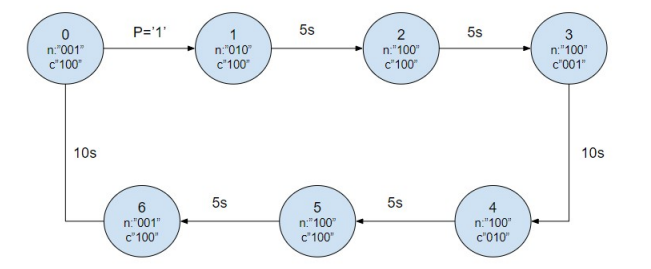
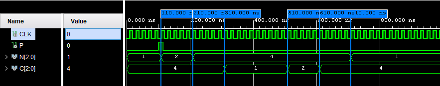

** Feux tricolore**

La gestion du carrefour doit être la suivante :
- En temps normal, le feu est vert pour les véhicules circulant sur la route nationale.
- Lors qu’arrive un véhicule au niveau d’un des deux feux de la route de campagne, le feu passe au
vert pour cette route pendant une durée fixe de 10 secondes.
- Lorsque le feu retourne au vert sur nationale, il y reste pendant au moins 10 secondes, même si un
nouveau véhicule se présente sur la route de campagne.
- La transition entre les deux voies doit se faire en toute sécurité : feu orange pour la voie passante
pendant environ 5 secondes, puis feu rouge pour les deux voies pendant 5 secondes 

soit:

avec :
- P:capteur pression
- N/C: feux national/communale "vert orange rouge"
- soit en base 10 1:rouge 2:orange x4:vert

verification avec un tick toute les 10ns

pour passer en secondes il suffit de multiplier la valeur cible du conteur par la fréquence d'horloge soit par exemple pour une horloge de 50Mhz:
- 5s: 250 x10^6 fronts montant
- 10s: 500 x10^6 fronts montant
